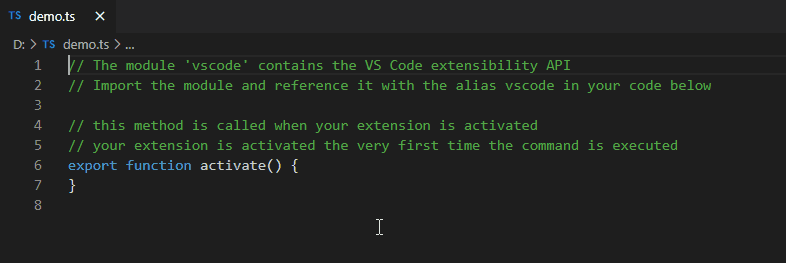
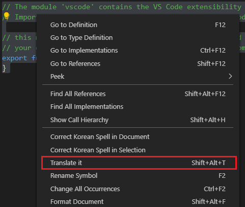
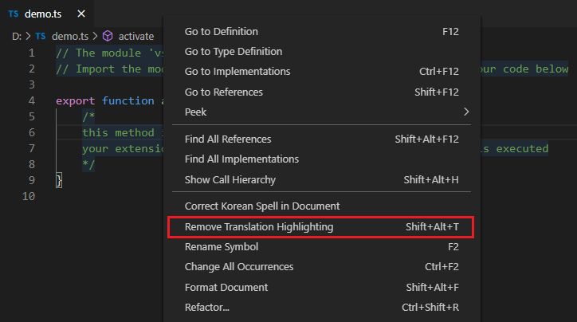

# Translate it

This extension is a text/comment translator powered by **Google Translate**.

## Features

- Translate selected texts from `Source Language` to `Target Language`
    - Automatically detect `Source Language` and `Target Language`
        - `Automatic Target Language` is your prefer display language of VSCode
        - You can also change `Target Language` in the **Extension Settings**
- Translate only comments when you select comments and codes
    - Supports more than 30 programming languages
    - See below a [demo](#usage)
- Display translated result as **Hover Message**
    - Click **Target Language** on header of hover message to change the `Target Language`
    - See below a [demo](#usage)
- And history logging in the **Output Channel**
    - See below a [demo](#history-logging)

## Installation

To install this extension go to `View->Extensions` and search for `translate-it`. Next click Install.

## Usage

To use the extension go to the Command Palette (`Cmd+Shift+P` on macOS or `Ctrl+Shift+P` on Windows) and launch `Translate it` command.
> Recommends to use keyboard shortcut `Shift+Alt+T`

And you can remove translation highlighting, if you execute `Translate it` command again with empty selection.

Or select `Translate it` from context menu (`Right-click` on editor).
> It's available when you select some text (single or multi select).

## History Logging

You can find the histories of translation in the **Output Channel**.

## Settings

Table of contributed settings (prefix "translateIt."):

| Name                     | Default       | Description                                                                                            |
| ------------------------ | ------------- | ------------------------------------------------------------------------------------------------------ |
| hoverDisplay             | `true`        | Display translated result as hover message (if `false`, always open **Output Channel** instead)                                                                   |
| hoverDisplayHeader       | `true`        | Display hover message with header area : `"Source Language → Target Language"`                                  |
| hoverMultiLineFormatting | `true`        | Display hover message with Multi-Line Formatting                                                               |
| targetLanguage           | `"Automatic"` | Target language ([list the supported](https://cloud.google.com/translate/docs/languages)) translate to |

## Issues

If you find any problems using this extension or you want to propose new features to it, feel free to open an issue on [Github](https://github.com/phoihos/vscode-translate-it/issues).

## Release Notes

Detailed Release Notes are available [here](https://github.com/phoihos/vscode-translate-it/blob/master/CHANGELOG.md) or above **Changelog** tab.
